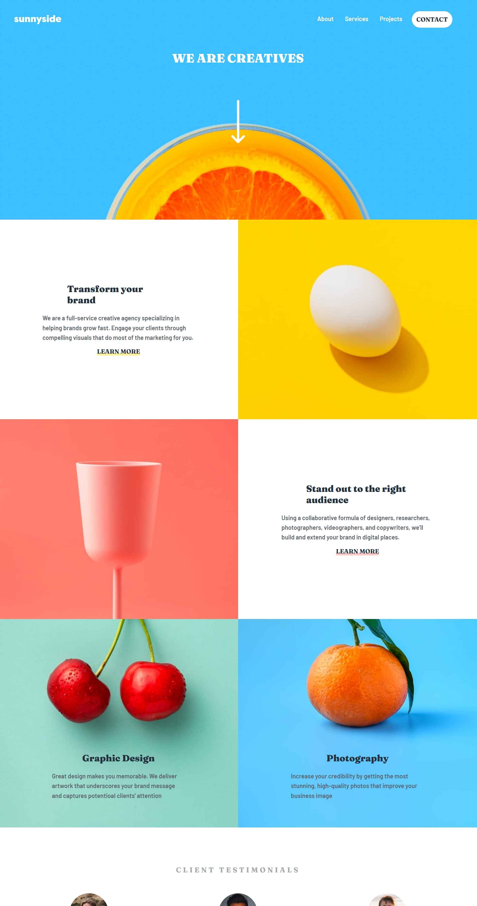

# Frontend Mentor - Sunnyside agency landing page solution

This is a solution to the [Sunnyside agency landing page challenge on Frontend Mentor](https://www.frontendmentor.io/challenges/sunnyside-agency-landing-page-7yVs3B6ef). Frontend Mentor challenges help you improve your coding skills by building realistic projects.

## Table of contents

- [Overview](#overview)
  - [The challenge](#the-challenge)
  - [Screenshot](#screenshot)
  - [Links](#links)
- [My process](#my-process)
  - [Built with](#built-with)
  - [What I learned](#what-i-learned)
  - [Continued development](#continued-development)
  - [Useful resources](#useful-resources)
- [Author](#author)
- [Acknowledgments](#acknowledgments)

## Overview

### The challenge

Users should be able to:

- View the optimal layout for the site depending on their device's screen size
- See hover states for all interactive elements on the page

### Screenshot

Add a screenshot of your solution. The easiest way to do this is to use Firefox to view your project, right-click the page and select "Take a Screenshot". You can choose either a full-height screenshot or a cropped one based on how long the page is. If it's very long, it might be best to crop it.

Alternatively, you can use a tool like [FireShot](https://getfireshot.com/) to take the screenshot. FireShot has a free option, so you don't need to purchase it.

Then crop/optimize/edit your image however you like, add it to your project, and update the file path in the image above.

**Note: Delete this note and the paragraphs above when you add your screenshot. If you prefer not to add a screenshot, feel free to remove this entire section.**

### Links

- Solution URL: [Add solution URL here](https://github.com/Ot-Charlie/Sunnyside-Agency-landing-page)
- Live Site URL:(https://ot-charlie.github.io/Sunnyside-Agency-landing-page/)

## My process

### Built with

- Semantic HTML5 markup
- CSS custom properties
- Flexbox
- CSS Grid
- Desktop-first workflow

### What I learned
This challenge helped me to undersand the way images behave and how to properly control them.

### Continued development
Hopeflly I can continue my Javascript development while enhancing my responsivenes abilities.

### Useful resources

- [Web 3 schools](https://www.w3schools.com/html/html_images.asp) - This helped me by giving me a breakdown of picture manipulation. 

## Author

- Website - [Onwuli Charles](https://www.onwuli-charles.netlify.app)
- Frontend Mentor - [Ot.Charlie](https://www.frontendmentor.io/profile/ot.charlie)
- Twitter - [Kingcharlie01](https://www.twitter.com/@kingcharlie01)

